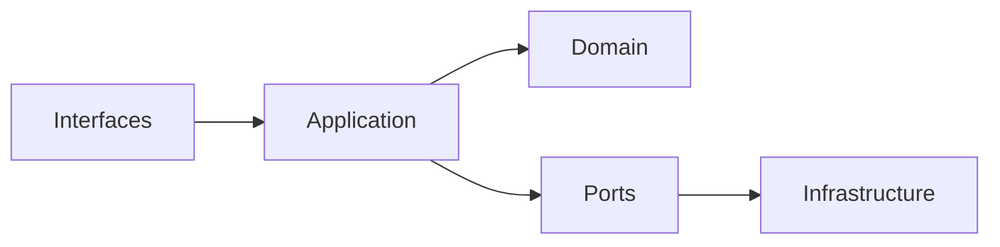
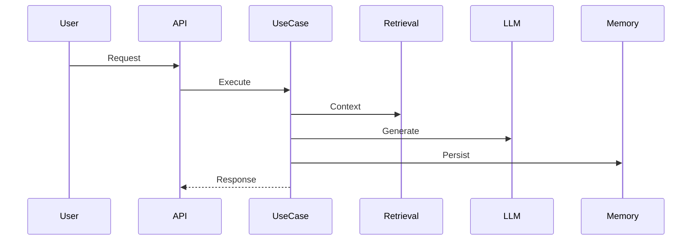

# 🧠 Architecture (Engine-Level)

## 🎯 Overview

The RPG Narrative Server is a **decoupled narrative engine**, built using Clean Architecture (Ports & Adapters).

The system is designed to be modular, extensible, and independent from specific frameworks or providers.

---

## 🧱 Layers

### Interfaces

- Entry points (FastAPI, Discord)
- Responsible for input/output

### Application (UseCases)

- Orchestrates the flow
- Depends only on ports

### Domain

- Pure business rules
- No external dependencies

### Ports

- Abstractions for external systems

### Infrastructure

- Implements ports
- LLM, databases, embeddings, APIs

---

## 🔄 End-to-End Flow

---

## 🧠 Architectural Decisions

- ❌ No frameworks inside the domain layer
- ✅ Ports isolate external dependencies
- ✅ Infrastructure is fully replaceable (LLM, DB, providers)
- ✅ UseCases define the application behavior

---

## 🔧 Extensibility

### Add a new LLM provider

1. Implement `LLMPort`
2. Register provider in factory/config
3. Configure via environment variables

---

### Add a new interface (e.g., CLI, Web UI)

1. Create new adapter under `interfaces/`
2. Map input → UseCase
3. Return formatted output

---

### Replace infrastructure (e.g., vector DB)

1. Implement corresponding port
2. Swap implementation in DI/config
3. No changes required in domain/application

---

## 💡 Key Principles

- Dependency inversion is mandatory
- Domain must remain pure
- Infrastructure must be replaceable
- System must support multiple execution environments (local, hybrid, cloud)

---

## 🚀 Summary

This architecture enables:

- scalability
- testability
- provider independence
- long-term maintainability

The system is not just a bot — it is a **narrative server platform**.
