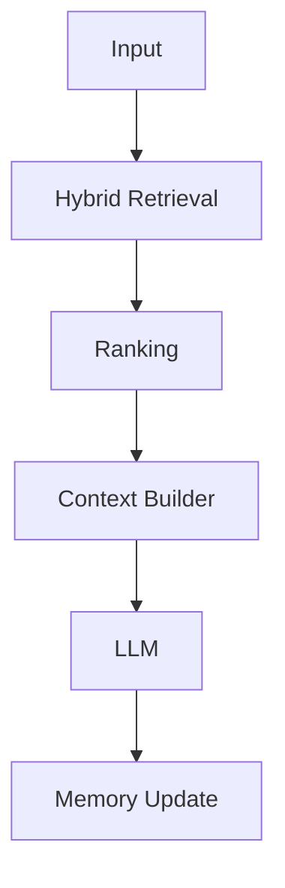
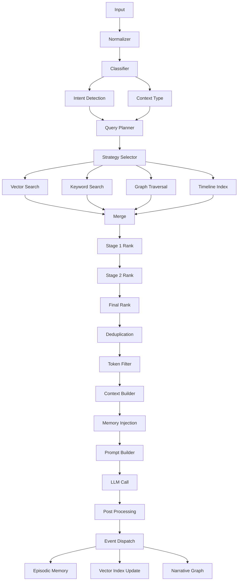

# 🔎 RAG Pipeline — Definitive (EN)

## 🎯 Overview

The RAG (Retrieval-Augmented Generation) pipeline of the RPG Narrative Server is a **multi-stage system designed for narrative context generation**.

Unlike simple RAG systems, this pipeline includes classification, planning, hybrid retrieval, ranking, and memory integration.

---

## 🟢 Simplified View (Onboarding)



This represents the high-level flow for quick understanding.

---

## 🔵 Full Pipeline (Engineering View)



---

## 🧪 Example (End-to-End)

### Input

```text
attack goblin
```

### Retrieved Context

- player state (HP, weapon, buffs)
- combat history
- nearby enemies

### Output

```text
You lunge forward, blade cutting through the air as the goblin snarls and raises its weapon...
```

---

## 🧠 Core Strategies

### Hybrid Retrieval

Combines multiple sources:

- Vector (semantic similarity)
- Keyword (BM25)
- Graph (narrative relationships)
- Timeline (recency)

---

### Multi-Stage Ranking

- Stage 1: semantic similarity
- Stage 2: hybrid scoring
- Final: narrative relevance

---

### Context Control

- Deduplication
- Token budget filtering
- Memory injection

---

## 🧰 Debugging Guide

When something goes wrong:

### 1. Inspect Retrieved Context

- Is it relevant?
- Is anything missing?

### 2. Analyze Ranking

- Are top results correct?
- Is scoring biased?

### 3. Check Prompt

- Is context properly injected?
- Are instructions clear?

---

## ⚙️ Extensibility

### Add a new retrieval strategy

1. Implement retrieval logic
2. Register in strategy selector
3. Update planner if needed

### Modify ranking

- Adjust scoring weights
- Add new ranking stage

### Replace providers

- LLM
- Embeddings
- Vector DB

---

## 💡 Key Design Principles

- Retrieval is independent from LLM
- Pipeline is modular and composable
- Vector index is treated as a black box
- Event bus is used only for side effects

---

## 🚀 Summary

This pipeline is not just RAG — it is a **narrative reasoning engine**.

It enables:

- coherent storytelling
- contextual decisions
- scalable narrative memory
