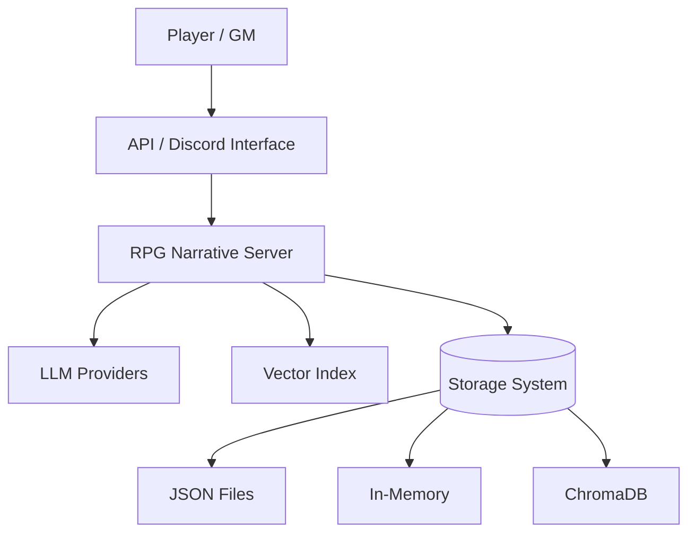
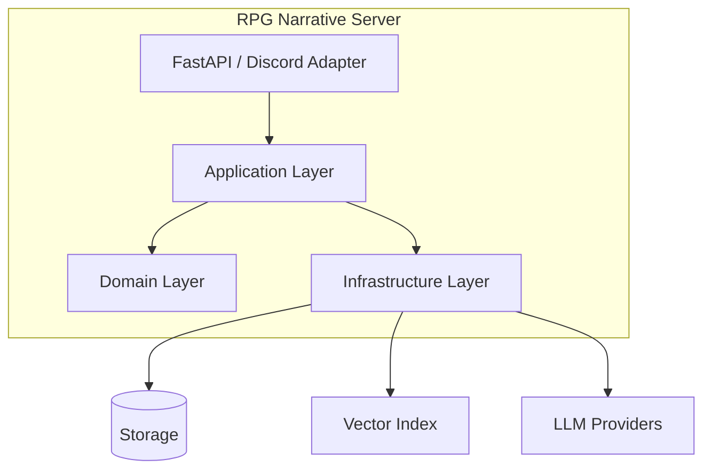
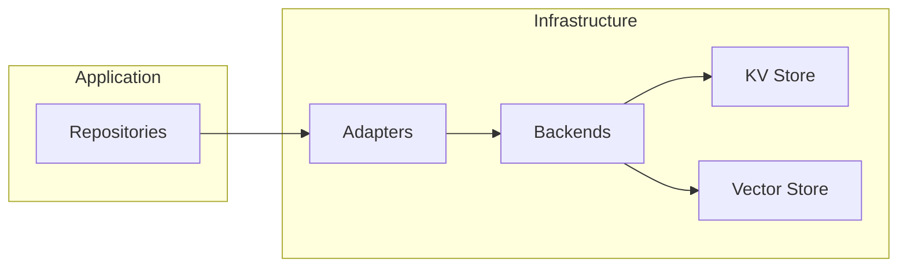
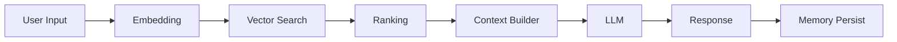

# 🧠 RPG Narrative Server — C4 Model (Context / Container / Component)

---

# 🌍 1. CONTEXT DIAGRAM



---

# 🧱 2. CONTAINER DIAGRAM



---

# 🧩 3. COMPONENT DIAGRAM (STORAGE)



---

# 🧬 4. COMPONENT DIAGRAM (RAG PIPELINE)



---

# 🔥 Key Insights

- Context: system interacts with external LLM + storage
- Containers: clean separation (API / Application / Domain / Infra)
- Components: adapters isolate storage + vector complexity
- RAG: fully modular pipeline

---

# 🚀 Mental Model

```
[User]
   ↓
[API]
   ↓
[Application]
   ↓
[Domain]
   ↓
[Infrastructure]
   ↓
[Storage + Vector + LLM]
```

---

