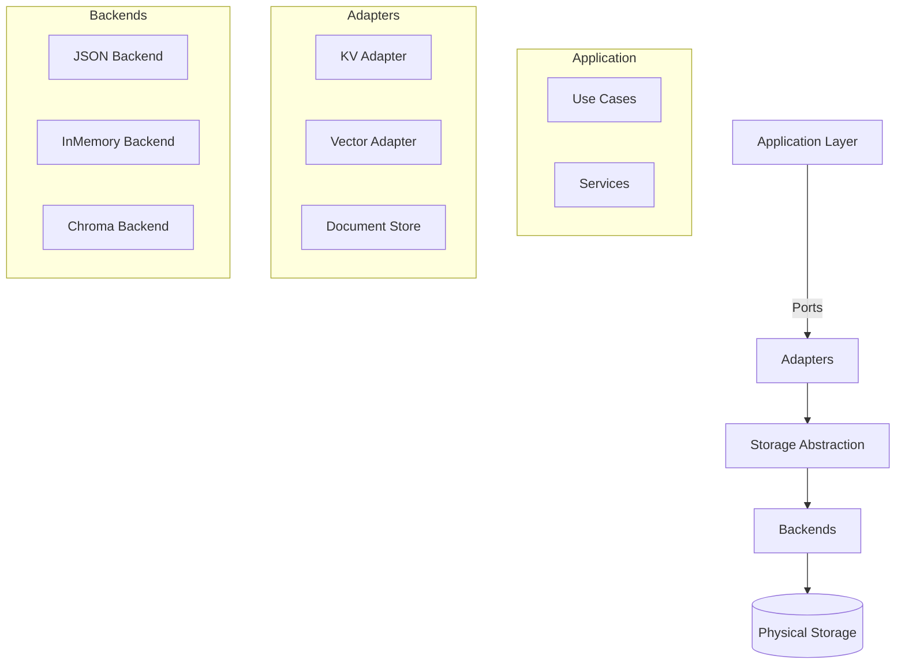
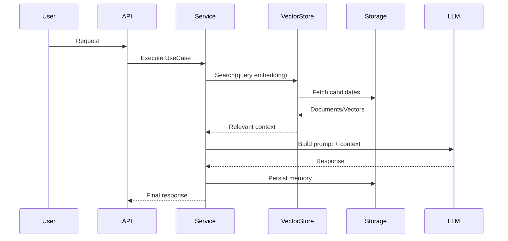
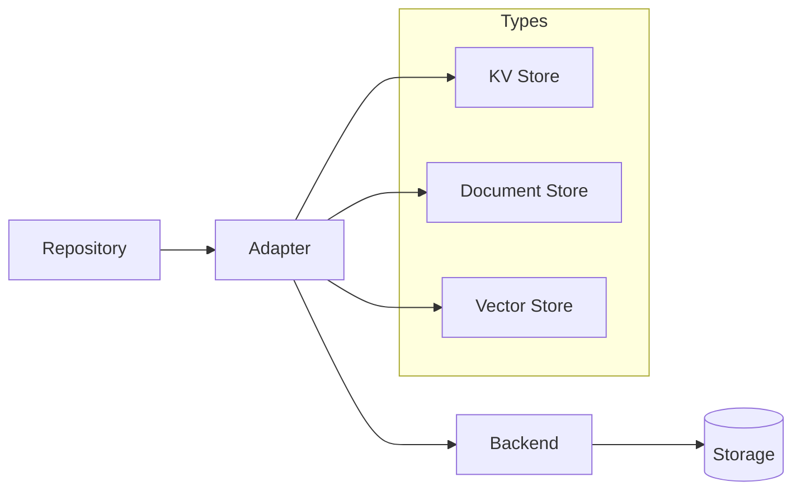

# 🧠 RPG Narrative Server — Storage & RAG Architecture Diagram

## 🎯 Overview

This document describes the full storage and retrieval flow using Clean Architecture + Ports & Adapters.

---

## 🧱 High-Level Architecture



---

## 🔁 RAG Flow



---

## 🧩 Storage Breakdown



---

## 🔑 Concepts

### KV Store
- Key → Value storage
- Base persistence layer
- Used for metadata, tokens, configs

### Vector Store
- Stores embeddings
- Enables semantic search
- Used in RAG pipeline

### Adapters
- Translate domain ↔ storage
- Serialize/deserialize data
- Enforce contracts

### Backends
- Implementation detail
- JSON, Memory, Chroma, etc

### Repositories
- Domain-oriented access
- Campaign, Narrative, Memory

---

## 🔥 Key Design Principles

- Clean Architecture enforced
- Storage fully decoupled
- Vector index treated as black box
- Pluggable backends
- Test-friendly (in-memory support)

---

## 🚀 Mental Model

```
Domain → Repository → Adapter → Backend → Storage
                          ↓
                    Vector Store (RAG)
```

---

## 🧠 Final Insight

This architecture allows:

- Swappable storage engines
- Independent evolution of vector search
- Isolation of domain logic
- Scalable RAG pipeline

