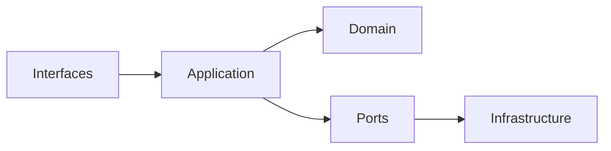
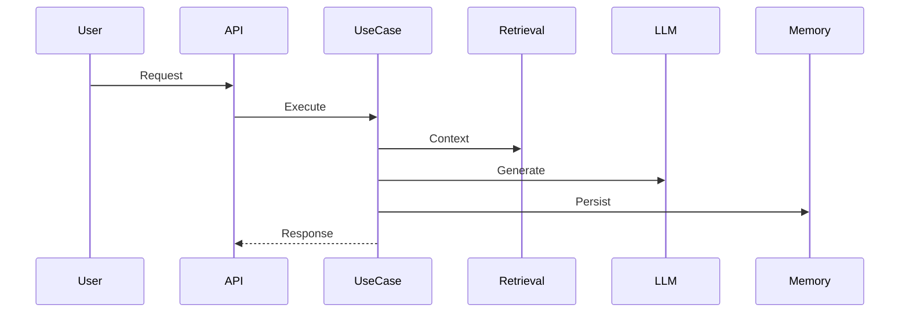

# 🧠 Arquitetura (Engine-Level)

## 🎯 Visão

O RPG Narrative Server é um **servidor de narrativa desacoplado**, baseado em Clean Architecture.

---

## 🧱 Camadas

---

## 🔄 Fluxo completo

---

## 🧠 Decisões arquiteturais

- ❌ Sem frameworks no domain
- ✅ Ports isolam dependências
- ✅ Infra trocável (LLM, DB)

---

## 🔧 Extensibilidade

Para adicionar novo LLM:

1. Criar implementação de LLMPort
2. Registrar no provider
3. Configurar via ENV
