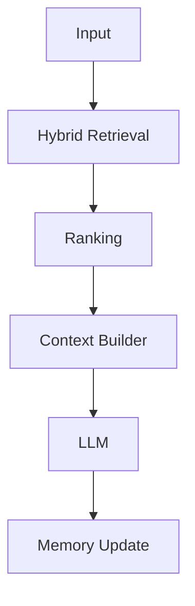
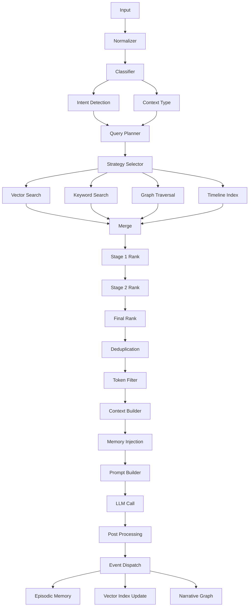

# 🔎 RAG Pipeline — Definitivo (PT-BR)

## 🎯 Visão Geral

O pipeline de RAG (Retrieval-Augmented Generation) do RPG Narrative Server é multi-stage e orientado a contexto narrativo.

---

## 🟢 Visão Simplificada

---

## 🔵 Pipeline Completo

---

## 🧪 Exemplo

### Input

"atacar o goblin"

### Contexto recuperado

- estado do jogador
- histórico de combate

### Output

"Você avança com sua espada..."

---

## 🧠 Estratégias

- Retrieval híbrido (vector + keyword + graph + timeline)
- Ranking multi-stage
- Controle de tokens
- Deduplicação

---

## 🧰 Debug

- validar contexto gerado
- inspecionar ranking
- analisar prompt final

---

## ⚙️ Extensibilidade

- adicionar novo provider de retrieval
- alterar estratégia no planner
- ajustar ranking
